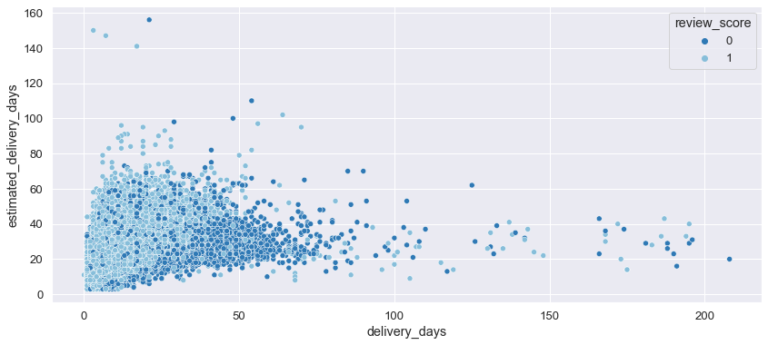
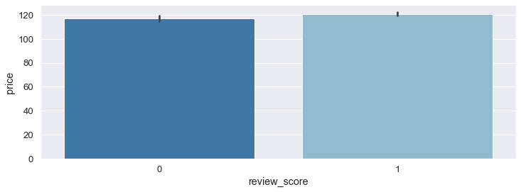
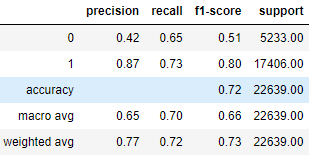

# Predicting E-commerce Customer Satisfaction

  

E-commerce connects many sellers to customers online. Providing better services to customers is one of the main keys to success as an e-commerce seller.

The quality of an e-commerce service is based on customer satisfaction. If customers are not satisfied with the services provided by the seller, then the seller should focus on the quality of service to attract customers, thus improving the business. Customer feedback plays a crucial role in the e-commerce business.

## Business Problem
Olist is an e-commerce intermediary from Brazil that provides a platform to connect merchants and their products to the main marketplaces in Brazil. This business is based on the interaction between consumers, the marketplace, Olist, and the seller. First, an order is placed by the consumer on the marketplace. This order is received by Olist, based on the order information notification sent to the sellers.

After that product is received from the seller and delivered to the consumer within the estimated delivery time. Once the customer receives the product, or if the estimated delivery date is due, the customer receives an email satisfaction survey where they can give a review score from 1 to 5, for the experience and note down some comments.

For the seller, knowing whether the review score is positive (4 or 5) or negative (from 1 to 3), plays a crucial role in improving the business. But often, customers don't give ratings or comments. Given this, the business problem arises. It is possible to predict if the consumer will give a positive or negative review score, before actually giving the review score and thus predict the review score for which the customer has not assigned any review score?

For this case study, was used the [Brazilian E-Commerce Public Dataset by Olist](https://www.kaggle.com/datasets/olistbr/brazilian-ecommerce), with information on 100,000 orders from 2016 to 2018 placed on various marketplaces in Brazil. Its features allow you to view an order from multiple dimensions: from order status, price, payment, and shipping performance to customer location, and product attributes, until geolocation data that relates Brazilian zip codes to latitude and longitude coordinates, and finally the review score along with customers comments.

## Problem Statement
For a given historical data set of purchases made from Brazilian e-commerce intermediated by Olist, predict the customer satisfaction (positive or negative) for the next purchases made from Brazilian e-commerce intermediated by Olist.

## Business Assumptions
* Negative review scores are very important when it comes to business improvement. It is much more important for the business to correctly identify as many negative review scores as possible than positive review scores.
* The dataset has information of 100k orders from 2016 to 2018 made at multiple marketplaces in Brazil.
* Features in the original dataset go as in [kaggle](https://www.kaggle.com/datasets/olistbr/brazilian-ecommerce).

## Solution Strategy
1. Data Cleaning
2. Exploratory Data Analysis
3. Feature Engineering & Feature Relevance
4. Model Selection & Model Evaluation
5. Hyperparameters Fine Tunning

## Main Data Insights
1. Most positive reviews have long estimated delivery days, but the actual delivery days are before or on schedule. 
2. Most negative review scores have short estimated delivery days, but the actual delivery days are longer than the expected time. 
3. Negative scores have a product price only 3.26% higher than positive review scores.

 

##  ML Modeling
###  ML Formulation
* Since the data has a target variable, it is a supervised Machine learning problem. 
* We need to predict customer satisfaction, positive or negative, so it is a binary classification problem. 
* As negative review scores are very important when it comes to business improvement, it is important to have low misclassification of negative review scores. Recall of the negative review score or the relation between negative predictions that are correctly realized (true negative) and all negative predictions (true negatives and false positives) is very important. 

### ML Models Used
* Logistic Regression
* Support Vector Machines
* K Neighbors 
* Decision Tree
* Random Forest
* XGBoost

### Overview
The work begins with an exploratory data analysis to support decision-making throughout the project. Early on we see that the target classes are unbalanced in number: the database has much more data on positive review scores than on negative review scores. Next, we see that there are a considerable number of categorical variables in the dataset, and also that the correlation of the predictor variables with the target is weak.

From the first results, the Random Forest and XGB models were dropped because they showed low recall for the negative review scores. After this, the performance of the algorithms was improved by eliminating less relevant predictors based on exploratory data analysis. Next, the choice of model was made by evaluating the metrics precision, recall, and f1_score. K Neighbors was chosen among all the others, mainly by the recall for negative review scores, since It is much more important for the business to correctly identify as many negative review scores as possible. Finally, the performance of the algorithm was improved by fine-tuning the hyperparameters.

### Final Results

## Conclusions
By eliminating less relevant predictors and making hyperparameter adjustments we improved the overall performance of the algorithm from an accuracy of 66% to 72% and a considerable improvement in correctly identifying positive review scores from 51.07% to 56.60%. Most important for the business is the correct identification of negative review scores, by eliminating the least relevant predictors and making hyperparameter adjustments, we went from correctly identifying negative review scores from 63% to 65%. 

The model still needs to be improved. Since the predictor variables have a weak relationship with the target variable, working more on feature engineering and using an algorithm for feature selection is something that might help. In any case, we already have a process, scalable and does not rely on subjective decisions, which generates time and resource savings.

## Next Steps
* Work on feature engineering to improve metrics.
* Use a feature selection algorithm to improve metrics.
* Test other models.
* Deploy the solution.

## References
Introduction Image by [Polina G](https://icons8.com/illustrations/author/DETSVS1CxEMr) on [Ouch!](https://icons8.com/illustrations).    
Dataset by Olist on [kaggle](https://www.kaggle.com/datasets/olistbr/brazilian-ecommerce).

